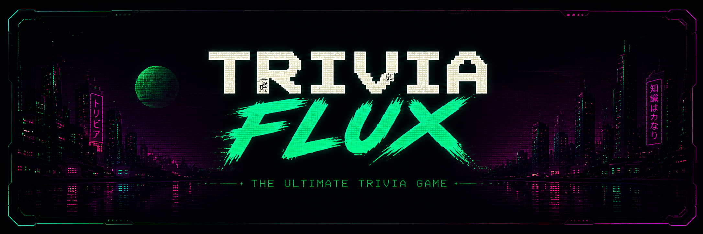
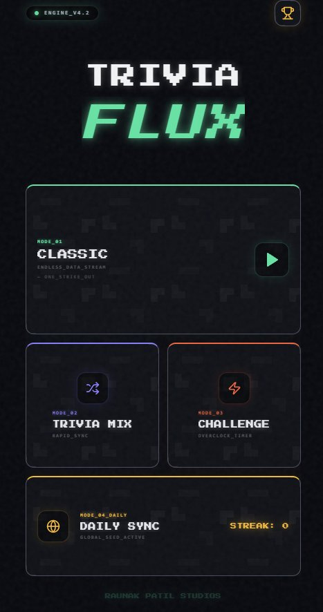
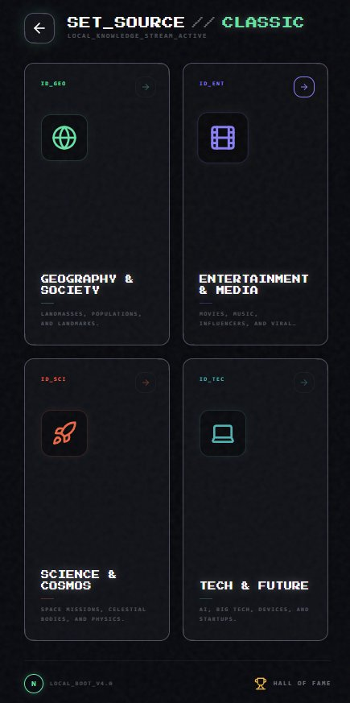
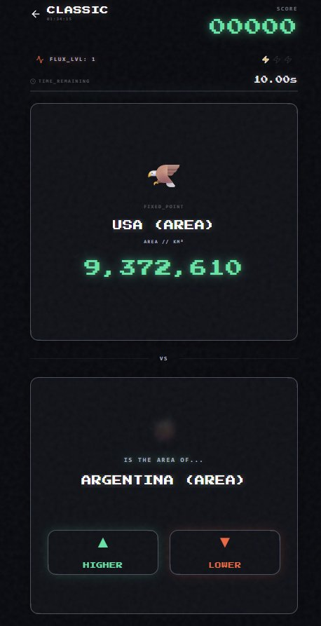

<div align="center">

# TriviaFlux

**An AI-powered Trivia Game built with Next.js, Firebase & Google Genkit**

[](https://nextjs.org/)
[](https://firebase.google.com/)
[](https://www.typescriptlang.org/)
[](https://tailwindcss.com/)
[](https://github.com/raunakpatil/triviaflux/releases/latest/download/TriviaFlux.apk)

[Download APK](#-download) · [Screenshots](#-screenshots) · [Features](#-features) · [Getting Started](#-getting-started) · [Tech Stack](#-tech-stack)

</div>

---

## 📱 Download

### ⬇️ [Download TriviaFlux.apk](https://github.com/raunakpatil/triviaflux/releases/latest/download/TriviaFlux.apk)

Or browse all versions on the [Releases page](https://github.com/raunakpatil/triviaflux/releases).

> **Requires Android 7.0+** — enable *Install from unknown sources* in your device settings before installing.

---

## 📸 Screenshots

<div align="center">
<table>
  <tr>
    <td align="center"><b>Home — Game Modes</b></td>
    <td align="center"><b>Category Select</b></td>
    <td align="center"><b>Classic Gameplay</b></td>
  </tr>
  <tr>
    <td></td>
    <td></td>
    <td></td>
  </tr>
</table>
</div>

---

## ✨ Features

- 🎮 **4 Game Modes** — Classic (one-strike-out), Trivia Mix (rapid sync), Challenge (overclock timer), and Daily Sync (global streak)
- 🌍 **4 Categories** — Geography & Society, Entertainment & Media, Science & Cosmos, and Tech & Future
- ⚡ **Higher / Lower Mechanic** — Compare real-world data points against a fixed reference in real time
- 🔥 **Daily Streak** — Come back every day to keep your streak alive with the global seed
- 🏆 **Hall of Fame** — Leaderboard to compete against other players
- 🤖 **AI-Powered Engine** — Questions generated via Google Genkit + Gemini (ENGINE_V4.2)
- 📱 **Cyberpunk UI** — Dark terminal aesthetic with pixel fonts, glitch effects, and neon accents

---

## 🛠 Tech Stack

| Layer | Technology |
|---|---|
| Framework | [Next.js 15](https://nextjs.org/) (App Router + Turbopack) |
| Language | TypeScript 5 |
| AI / LLM | [Google Genkit](https://firebase.google.com/docs/genkit) + Gemini |
| Backend | [Firebase](https://firebase.google.com/) (Auth, Firestore, Hosting) |
| UI Components | [Radix UI](https://www.radix-ui.com/) + [shadcn/ui](https://ui.shadcn.com/) |
| Styling | Tailwind CSS + tailwindcss-animate |
| Forms | React Hook Form + Zod |
| Charts | Recharts |
| Mobile Build | [Codemagic CI/CD](https://codemagic.io/) |

---

## 🚀 Getting Started

### Prerequisites

- Node.js 20+
- A Firebase project ([create one here](https://console.firebase.google.com/))
- A Google AI API key ([get one here](https://aistudio.google.com/))

### Installation

```bash
# 1. Clone the repo
git clone https://github.com/raunakpatil/triviaflux.git
cd triviaflux

# 2. Install dependencies
npm install

# 3. Set up environment variables
cp .env.example .env
# Fill in your Firebase config and Google AI API key in .env

# 4. Start the dev server
npm run dev
```

The app will be running at `http://localhost:9002`.

### Environment Variables

Create a `.env` file in the root with the following:

```env
# Firebase
NEXT_PUBLIC_FIREBASE_API_KEY=
NEXT_PUBLIC_FIREBASE_AUTH_DOMAIN=
NEXT_PUBLIC_FIREBASE_PROJECT_ID=
NEXT_PUBLIC_FIREBASE_STORAGE_BUCKET=
NEXT_PUBLIC_FIREBASE_MESSAGING_SENDER_ID=
NEXT_PUBLIC_FIREBASE_APP_ID=

# Google AI (Genkit)
GOOGLE_GENAI_API_KEY=
```

### Available Scripts

```bash
npm run dev          # Start dev server on port 9002 (Turbopack)
npm run build        # Production build
npm run start        # Start production server
npm run lint         # Run ESLint
npm run typecheck    # TypeScript type checking

# Genkit AI flows
npm run genkit:dev   # Start Genkit dev UI
npm run genkit:watch # Start Genkit with file watching
```

---

## 📦 Building the Android APK

This project uses [Codemagic](https://codemagic.io/) for CI/CD to build the Android APK.

1. Connect your GitHub repo to Codemagic
2. Configure your `codemagic.yaml` with signing credentials
3. Trigger a build — the APK will be available as a build artifact

To add a release manually, go to **Releases → Draft a new release** on GitHub and upload `TriviaFlux.apk` as a release asset.

---

## 🤝 Contributing

Contributions are welcome! Feel free to open an issue or submit a pull request.

1. Fork the repo
2. Create a feature branch (`git checkout -b feature/cool-thing`)
3. Commit your changes (`git commit -m 'Add cool thing'`)
4. Push and open a PR

---

<div align="center">
Made with ❤️ by <a href="https://github.com/raunakpatil">@raunakpatil</a>
</div>
